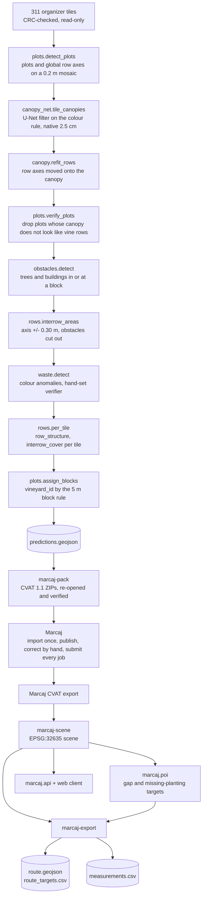

# BloomSense: Marcaj Vineyard AI Field Challenge

Deeptech GigaHack 2026, team BloomSense.

BloomSense turns the 311 Sireț3 drone tiles (RGB, 2.5 cm/px, EPSG:32635) into vineyard annotations in the organizers' four classes: `vineyard` canopy polygons, `row` axes, `interrow_area` polygons and `waste` boxes, with `vineyard_id`, `row_id`, `row_structure` and `interrow_cover`. The annotations go to Marcaj as pre-annotations and are corrected there by hand. From the corrected Marcaj export the pipeline computes block and row counts, row lengths and areas (`measurements.csv`), inspection points at row gaps and missing planting, and a closed walking route from the organizer START that stays in inter-rows and authorised passages (`route.geojson`). A web map shows fields, IDs, measurements and routes, and plans new routes on request.

Demo: served from the team laptop at `http://127.0.0.1:8000` (see [Web app](#web-app)).

| Deliverable | Where |
|---|---|
| `route.geojson` | repository root, written by `marcaj-export`: one LineString in EPSG:32635 with `length_m` |
| `measurements.csv` | repository root, written by `marcaj-export`: total, per block (`vineyard_id`) and per row (`row_id`) |
| `route_targets.csv` | repository root: every route target, visited or not, with its distance to the route and the reason |
| Annotations | the team's Marcaj project |
| Neural-network weights | [`models/canopy_net.pt`](models/canopy_net.pt), committed (7,903,127 bytes) |

## Pipeline



The prediction stages are the calls in [`predict.py`](backend/src/marcaj/predict.py), in that order. Everything is predicted over the whole site with global `vineyard_id` and `row_id`; objects are cut per tile only when packing (`cvat.image_elements`), so IDs survive tile edges.

### Neural network and classical parts

**Neural network: [`canopy_net`](backend/src/marcaj/canopy_net.py).** A U-Net in plain PyTorch: 5 levels, 6 input channels (scaled RGB plus RGB chromaticity), 2 outputs, 1,964,546 parameters. It was randomly initialised (no downloaded weights) and self-trained on the rule-based canopy of 118 vineyard tiles, with the two organizer example tiles and their neighbours held out. It was never trained on hand-drawn Sireț3 geometry. In `predict` it runs on every tile a row crosses, in 1024 px windows with 64 px of context, and keeps the colour-rule pixels whose canopy probability exceeds 0.2. On the example tiles this filter ties with the rules alone (canopy 0.851 against 0.852); the network alone scores 0.843. `predict` runs the canopy a second time on the rows refit onto the first canopy, which lifts canopy to 0.857 ([notes](research/notes/canopy_net.md)). It runs on Apple MPS when available, otherwise CPU.

Retraining (from `backend/`; the shipped weights are run `v14_deep` on label snapshot `ff679923`, 6,000 steps in 834 s on MPS):

```sh
uv run --frozen --group sam python ../research/probes/canopy_net_labels.py      # rule labels -> data/generated/work/canopy_net/
uv run --frozen --group sam python ../research/probes/canopy_net_train.py --name v14_deep --no-grass \
    --gap-weight 5 --cut-reach 9 --jitter 0.2 --doubt 0.1 --depth 5 --steps 6000
cp ../data/generated/work/canopy_net/runs/v14_deep.pt ../models/canopy_net.pt
```

`--labels` defaults to the newest label snapshot; pass `--labels ff679923` to train on the historical one if it is present.

**Classical image processing and geometry (no training):**

| Stage | Method |
|---|---|
| Plots and row axes ([`plots`](backend/src/marcaj/plots.py)) | Directional row energy on a 0.4 m grid ([`layers`](backend/src/marcaj/layers.py)): vine spacing (2.0-3.6 m) against orchard spacing. Per plot a row lattice (angle, spacing, phase), quadrilateral fit, row walk outward, 5 m merge, road rule. A second pass on a top-hat layer adds narrow young strips; cadastral parcels extend a plot only where the plot's own rows continue, and separate blocks at tracks |
| Canopy ([`canopy`](backend/src/marcaj/canopy.py)) | 2G - R - B > 25 in pixel values inside a +/- 0.30 m tube of each twice re-fitted axis, weak stretches of a row at a lower threshold, 0.05 m closing, split at necks, verge-grass axes dropped, pieces of at least 0.2 m² (0.05 m² in young blocks and rows), 0.01 m inset |
| Inter-rows and attributes ([`rows`](backend/src/marcaj/rows.py)) | Polygons between neighbouring axes, inset 0.30 m from each, extended up to 1.5 m onto passages. `row_structure`: `disrupted` for a vine-free stretch of 5 m or more; `interrow_cover`: green share under 25% `bare_soil`, over 75% `vegetation`, else `mixed`; `unassessable` without evidence |
| Obstacles ([`obstacles`](backend/src/marcaj/obstacles.py)) | Tree crowns and roofs that survive a 2.2 m morphological opening on the mosaic |
| Waste ([`waste`](backend/src/marcaj/waste.py)) | Colour anomalies against a 2 m median background inside predicted inter-rows (plus 2 m inside blocks), accepted by a hand-set verifier |
| Inspection points ([`poi`](backend/src/marcaj/poi.py)) | Rows sampled every 5 cm; a canopy-free stretch between planted parts is a `gap` when it is 5 m or more, or 3 m or more and an outlier against its own field's canopy spacing (median, capped at the 2 m planting distance, plus 3 robust spreads, so a sparse field cannot hide its gaps); an unplanted row end next to planted neighbours is `planting` |
| Route ([`route`](backend/src/marcaj/route.py)) | 0.5 m grid over inter-rows (eroded 0.3 m) and passages, 16-direction Dijkstra, nearest neighbour + 2-opt + Or-opt tour, 1.2% outside budget, checked by [`routing.check_route`](backend/src/marcaj/routing.py) |

SAM 2.1 ([`sam.py`](backend/src/marcaj/sam.py), [`canopy_sam.py`](backend/src/marcaj/canopy_sam.py)) was tried in research and is not called by the pipeline.

## Install

Requires Python 3.11-3.13 (measured on 3.11.16), [uv](https://docs.astral.sh/uv/) 0.10+, Node.js 22.12+ and npm. Dependencies are pinned in `backend/uv.lock` and `web/package-lock.json`.

```sh
cd backend
uv sync --frozen --group sam      # torch for canopy_net is in the "sam" group
cd ../web
npm ci
npm run build                     # typechecks, then writes web/dist
```

## Data

Put the organizer package at `data/raw/marcaj-data.zip` and unzip it:

```sh
unzip data/raw/marcaj-data.zip -d data/raw/marcaj
```

```text
data/raw/marcaj/01_tiles/siret3_challenge_tiles_part{1..5}of5.zip   the 311 tiles
data/raw/marcaj/02_route/{start,passages,forbidden,study_area}.geojson
data/raw/marcaj/04_source/siret3_source_orthomosaic_EPSG4326.tif    map imagery only
data/raw/marcaj/05_examples/siret3_examples_cvat.zip                the two annotated example tiles
data/raw/marcaj/tiles/                           extracted on the first run, then read-only
data/raw/external/cadastre/parcels_32635.geojson cadastral parcels, fetched once (run_all.sh does it)
data/raw/external/sentinel/                      Sentinel-2 windows, cached by the first POI run
data/generated/                                  caches and generated files
```

`tiles.load_tiles` extracts the tiles from the part ZIPs, checks every file's size and CRC against its ZIP entry on every run, rejects any other CRS, size or pixel grid, and makes the tiles read-only. Nothing writes into `data/raw/marcaj/tiles/`. `data/raw`, `data/generated` and `output` are git-ignored.

## Run

### One command

```sh
scripts/run_all.sh                         # automatic: tiles -> predictions -> CVAT ZIPs -> scene -> POIs -> route.geojson, measurements.csv
scripts/run_all.sh data/marcaj_export.zip  # submission: the same from the corrected Marcaj CVAT export
```

The automatic form packs the predictions into the same CVAT 1.1 ZIPs Marcaj imports (`output/roundtrip/`) and reads them back, so it measures the uncorrected pre-annotations. The submitted files come from the second form: the Marcaj export replaces the ZIPs. Both write `route.geojson`, `route_targets.csv` and `measurements.csv` to the repository root, the scene to `data/generated/scene.json` (what the app serves) and the client routes to `data/generated/routes.geojson`.

| Variable | Default | Effect |
|---|---|---|
| `OUT` | repository root | where the three submission files go |
| `SCENE` | `data/generated/scene.json` | the scene file written and exported |
| `NO_SATELLITE` | unset | `1` skips the Sentinel-2 layer (the route and measurements do not use it) |
| `MARCAJ_DATA_DIR` | `data/raw/marcaj` | the unzipped organizer package |

### Step by step

What the script runs, from `backend/`:

```sh
uv run --frozen python -m marcaj.cadastre --fetch       # once, if data/raw/external/cadastre/parcels_32635.geojson is missing
uv run --frozen --group sam python -m marcaj.predict    # data/generated/predictions.geojson, canopy_flags.csv
uv run --frozen marcaj-pack --scene ../data/generated/predictions.geojson   # output/upload/: ZIPs under 88,000,000 bytes, verified
# Marcaj: upload every part, check 311 files, publish, correct, submit every job, export CVAT 1.1
uv run --frozen python -m marcaj.obstacles              # obstacles from the predicted blocks, for poi
uv run --frozen marcaj-scene --cvat ../data/marcaj_export.zip             # data/generated/scene.json
uv run --frozen python -m marcaj.poi --scene ../data/generated/scene.json # add --no-satellite to stay offline
uv run --frozen marcaj-export --output-dir .. --poi ../data/generated/work/poi/poi.geojson
```

`marcaj-export` refuses to write a route that would score 0: more than 2% of its length outside inter-rows and passages, not closed within 5 m of START, or crossing forbidden zones or mature canopy. Targets it cannot reach within its 1.2% outside budget are listed in `route_targets.csv` with the reason. The tour is a heuristic, not a proven shortest route.

### Marcaj rules the workflow keeps

- Pre-annotations are imported once, before Publish: upload every part, check that Marcaj shows 311 files, then publish.
- Dry run first with two example tiles: `marcaj-scene --cvat ../data/raw/marcaj/05_examples/siret3_examples_cvat.zip`, then `marcaj-pack --scene ../data/generated/scene.json --source reference --only siret3_r021_c012.tif,siret3_r006_c004.tif --output-dir ../output/dryrun`.
- Manual correction happens only in Marcaj. Verdicts recorded in the research tools are evaluation evidence: prediction code and `marcaj-pack` never read `data/review/`.
- Every scene feature carries `source`: `reference` (CVAT input), `organizer` (START, passages, forbidden zones, study area, tiles) or `prediction`. Measurements and the route ignore `prediction`.

## Web app

```sh
cd web && npm run build
cd ../backend && uv run --frozen uvicorn marcaj.api:app --host 127.0.0.1 --port 8000
```

Open `http://127.0.0.1:8000` (inspector) or `http://127.0.0.1:8000/?role=farmer`. The app needs `data/generated/scene.json` (from `run_all.sh` or `marcaj-scene`).

For the pitch, `scripts/demo.sh` starts the app and the Telegram bot together (Ctrl+C stops both); the 2-minute click path and the fallbacks are in [docs/DEMO.md](docs/DEMO.md).

- Map: drone imagery rendered from the source orthomosaic, fields with `vineyard_id`, rows with `row_id`, canopies, inter-rows, waste and inspection points.
- Measurements: site totals, each field, and a sortable row table; the same numbers as `measurements.csv`. A field not yet annotated in Marcaj is measured from the predictions and marked as a model estimate.
- Routes: the site route and one route per field, per confidence cutoff (all, >= 0.5, >= 0.7), with length and visited targets. "Plan a walk" sets start and end on the map for the whole farm or one field, calls `POST /api/route`, and downloads the result as an official-format `route.geojson`.
- Roles: the inspector sees every field, point and score; a farmer (one field is one farmer) sees waste and missing canopy, marks points in progress, fixed or false positive, and plans a walk over the open points; the inspector approves or rejects the claims. There is no authentication (single-site demo).
- Layers: Sentinel-2 NDVI and NDMI before the flight, cadastral parcels. A yield and harvest page keeps manual records in the browser.

| Endpoint | Returns |
|---|---|
| `GET /health` | `{"status": "ok"}` |
| `GET /api/scene` | the scene as a lon/lat display copy, measurements, routes |
| `GET /api/imagery/{z}/{x}/{y}.png` | map tiles from the source orthomosaic |
| `POST /api/route` | a route on request: `start`, `end` ([lon, lat] or {easting, northing}), `scope` (site or a `vineyard_id`), `min_confidence`, `hops`, `kinds`, `open_only`; 422 for invalid input, 413 over 2 KB |
| `POST /api/route/geojson` | the same route in the `route.geojson` format (EPSG:32635) |
| `GET /api/points`, `POST /api/points/{id}/status` | point statuses (append-only log in `data/app/point_status.json`) and farmer scores |

At start the API builds or loads two route plans (with and without row hops, about 2.5 min each when cold, cached in `data/generated/work/route/cache/`). After changing Python code, restart the server. Front-end development: `npm run dev` in `web/` (port 5173, proxies `/api` to port 8000).

### Research tools

Kept out of the client:

- Lab notebook ([`research/lab.ipynb`](research/lab.ipynb), [`marcaj.lab`](backend/src/marcaj/lab.py)): `uv sync --frozen --group sam --group lab`, then `uv run --frozen --group sam --group lab jupyter lab ../research/lab.ipynb`. `Lab()` runs the prediction, `lab.run(...)` reruns with other plot parameters, `lab.report()` judges, `lab.save()` writes predictions and a development scene (it overwrites `data/generated/scene.json`).
- Review tool ([`research/review/`](research/review/)): `uv run --frozen python ../research/review/build.py`, then `uv run --frozen python ../research/review/server.py` on `http://127.0.0.1:8010`. Verdicts go to `data/review/verdicts.json`.
- Local judge: `uv run --frozen marcaj-judge [--json report.json]` scores the predictions in `data/generated/scene.json` against the example tiles (build that scene with `marcaj-scene --cvat ../data/raw/marcaj/05_examples/siret3_examples_cvat.zip --predictions ../data/generated/predictions.geojson`).
- [`research/probes/`](research/probes/) and [`research/notes/`](research/notes/): experiments and their results, not pipeline stages.

## Telegram bot

Farmers don't install another app, so the route also goes to Telegram. [`marcaj.telegram_bot`](backend/src/marcaj/telegram_bot.py) sends the precomputed routes in `data/generated/routes.geojson` (it never plans one) and uses only the Python standard library and the existing dependencies.

1. In Telegram, open @BotFather, send `/newbot`, pick a name and a username, and copy the token it returns.
2. Run the bot from `backend/` (keep the token out of git and out of `.env.example`):

```sh
TELEGRAM_BOT_TOKEN=<token> uv run --frozen python -m marcaj.telegram_bot
uv run --frozen python -m marcaj.telegram_bot --render V06-03 --out ../data/generated/work/telegram/V06-03.png   # offline, prints the message
uv run --frozen python -m marcaj.telegram_bot --check                                                          # every route: order and picture checks
```

- `/start` lists the fields. `/field V06-03`, or just `V06-03`, sends that field's walk; `/site` sends the whole farm.
- The reply is one picture and one message. The picture is the drone mosaic around the route with the route in yellow, START, the stops numbered in walking order (red: missing vines, blue: waste, grey: skipped), a legend, the length and a scale bar. When START is far from the field, the picture frames the field and marks where the route comes in, with the walking distance to START.
- The message gives the length, the walking time at 4 km/h and a numbered checklist in the same order: what to check at each stop and a Google Maps link. Skipped points are counted; a long list ends with "…and N more on the map".
- The bot uses long polling, so it needs no public address. It handles each message on its own, answers an unknown field with the list, and retries with backoff when the network drops.

## Docker

```sh
docker build -t bloomsense .

# the app on http://127.0.0.1:8000, serving data/generated/scene.json
docker run --rm -p 8000:8000 -v "$PWD/data:/app/data" bloomsense

# the pipeline; the submission files land in ./output/
docker run --rm -v "$PWD/data:/app/data" -v "$PWD/output:/app/output" -e OUT=/app/output \
    bloomsense /app/scripts/run_all.sh                                   # automatic
docker run --rm -v "$PWD/data:/app/data" -v "$PWD/output:/app/output" -e OUT=/app/output \
    bloomsense /app/scripts/run_all.sh /app/data/marcaj_export.zip      # from the Marcaj export
```

The image is Python 3.11 slim with `uv sync --frozen --group sam`, the web client built in a Node 22 stage, and `models/canopy_net.pt`. The data is not in the image: mount `data/`. The locked Linux PyTorch wheel brings its CUDA runtime, so the image is several GB. In the container PyTorch runs on CPU (no MPS), so the prediction takes longer than the table below; give Docker at least 6 GB of memory.

## Timing and hardware

> Measured on 26 Sep 2026: prediction on the final model run (v5); route rows on the v4.5 and v5 predictions.

Apple M4 Pro (12 cores), 24 GB RAM, macOS 26.6, Python 3.11.16, PyTorch 2.14.0 on Apple MPS.

| Stage | Command | Wall time | Peak memory |
|---|---|---|---|
| 0.2 m mosaic of the 311 tiles (cold run only) | inside `marcaj.predict` | 11 s | |
| 0.4 m plot layers (cold run only; a top-hat variant is cached beside them) | inside `marcaj.predict` | 17 s | |
| Full prediction, 311 tiles (canopy runs twice) | `python -m marcaj.predict` | 406 s (408 s process) | 3.50 GB RSS |
| Inspection points | `python -m marcaj.poi` | 13 s | 0.6 GB |
| Route export: official route, site and per-field routes at 3 cutoffs, with and without row hops | `marcaj-export` | 340-455 s | 2.5-3.4 GB |
| One route plan, cold | API warm-up | 130-150 s | |
| Route on request, warm plan | `POST /api/route` | 0.3-3.1 s | |

`scripts/run_all.sh` in automatic mode takes about 14 minutes on this machine, summed from the rows above plus packing, obstacles and scene building (not timed as one run). The v5 prediction produced 40 blocks, 677 rows (1,960 row pieces per tile), 1,913 inter-row pieces, 14,616 canopies and 30 waste boxes. Waste runs in 2 worker processes; canopy, attributes and waste work tile by tile, and the site-wide plot search runs on the 0.2 m mosaic (64 times fewer pixels than the tiles).

## Evaluation

`marcaj-judge` applies the organizers' formulas to the two example tiles the organizers annotated (`siret3_r006_c004`, `siret3_r021_c012`):

| Criterion (points) | Score |
|---|---|
| Canopy (25): 0.6 x IoU + 0.4 x F1 | 0.857 (IoU 0.827, F1 0.901) |
| Row axes (8) | 0.970 |
| Attributes (5) | 0.974 |
| Grouping by `vineyard_id` (2) | 1.000 |
| Counts and measurements (10) | 0.897 |
| **Points, of the 50 the judge covers** | **45.03** |

These tiles were used while tuning, so this is a sanity check, not a holdout estimate. Waste (10), route (25) and engineering (15) are not scored locally; the examples contain no waste. The judge passed its controls: an exact copy of the reference scores 50/50, rows shifted 0.35 m sideways score 1.0 and at 0.6 m score 0.0, half the canopies dropped give 0.576, flipped attributes give 0, and one block for everything gives grouping 0.52.

## Outputs and formats

All geometry is in EPSG:32635 metres. The map receives a lon/lat display copy that is never measured.

- `route.geojson`: a FeatureCollection with the organizers' `crs` member (`urn:ogc:def:crs:EPSG::32635`) and one LineString feature with `length_m`.
- `measurements.csv`: `level,vineyard_id,row_id,block_count,row_count,row_length_m,canopy_area_m2,canopy_area_ha,interrow_area_m2,interrow_area_ha`, with `level` `total`, `block` or `row`. Canopy and inter-row areas are unions; row length sums the pieces of each `row_id`; values are rounded to 3 decimals only when written.
- `route_targets.csv`: per target `id`, label, `status` (`visited`, `over_budget`, `unreachable`), distance to the route and reason.
- Upload ZIPs: CVAT for images 1.1 (`annotations.xml` plus the unchanged tiles under `images/`).

## Data sources and licences

| Source | Terms |
|---|---|
| Sireț3 imagery (organizer tiles and source orthomosaic) | CC BY 4.0, 3DATA COLLECT / OpenAerialMap, contributors to the Open Imagery Network |
| Organizer route data | contains information from OpenStreetMap, © OpenStreetMap contributors, ODbL |
| Client basemap | © OpenStreetMap contributors |
| Sentinel-2 L2A, Earth Search `sentinel-2-c1-l2a` (anonymous access) | Contains modified Copernicus Sentinel data 2025 |
| Cadastral parcels, public WMS of I.P. Cadastrul Bunurilor Imobile (snapshot of 26 Sep 2026) | credit "Cadastru: I.P. Cadastrul Bunurilor Imobile"; the service lists no fees or access constraints, and we found no explicit reuse licence |
| `canopy_net` weights | our own, trained from scratch on the organizer tiles |

## Paid APIs and LLMs

- Claude Code (Anthropic) and Codex (OpenAI) were used as coding assistants during development. Codex also ran one web research sweep of methods and datasets ([prompt](research/2026-09-25-codex-research-prompt.md), [result](research/2026-09-25-codex-research-sweep.md)).
- No LLM and no paid API runs in the prediction pipeline or the app. `backend/src` and `web/src` contain no LLM SDK, API key or LLM endpoint. Runtime network use is the anonymous Sentinel-2 search and window reads (cached, optional), the one-time cadastre fetch, and OpenStreetMap basemap tiles loaded by the browser.
- `transformers` in the `sam` group serves only the SAM 2.1 research modules (image segmentation, not a language model), which the pipeline does not call.

## Repository

| Path | Holds |
|---|---|
| `backend/src/marcaj/` | the Python package: pipeline, CVAT converter and packer, measurements, POIs, route, API |
| `web/` | the client (Vite, TypeScript, Leaflet); no annotation tooling |
| `models/canopy_net.pt` | U-Net weights |
| `scripts/run_all.sh` | tiles to `route.geojson` and `measurements.csv` |
| `research/` | lab notebook, review tool, probes and notes |
| `data/review/verdicts.json` | team verdicts, evaluation evidence only |
| `docs/` | [specification](docs/SPEC.md), [status](docs/STATUS.md), [organizer playbook](docs/ORGANIZER_PLAYBOOK.md), [research](docs/RESEARCH.md), [inspection product](docs/INSPECTION_PRODUCT.md), [architecture research](docs/ARCHITECTURE_RESEARCH_2026-09-25.md), [code review of 26 Sep](docs/CODE_REVIEW_2026-09-26.md), [EU alignment](docs/EU_ALIGNMENT.md) |

Checks: `uv run --frozen python -m compileall -q src` (from `backend/`), `npm run build` (typechecks `web/`), the packer's self-verification, and `marcaj-judge`.
