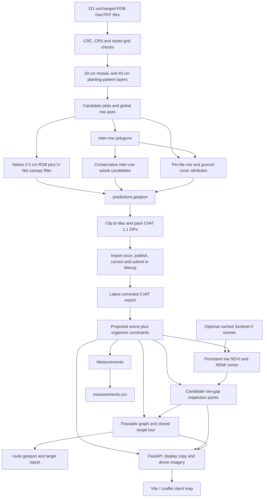

# GigaHack Marcaj — Vineyard AI Field Challenge

Sireț3 drone imagery → automatic pre-annotations → human correction in Marcaj → vineyard measurements and an inspection route → Agrocontrol by BloomSense map.

The detector is a **hybrid system**: image processing finds planting patterns and row geometry; a small, locally trained U-Net filters canopy pixels; geometry processing produces the organizer's four annotation classes. Humans confirm and correct the annotations in Marcaj before final measurements and routing.

**Review snapshot: 26 September 2026.** The detector, converter, packer, measurement functions, POI generator, route solver and map exist. The application is still a development demonstration: the saved scene mixes two reference tiles with full-site predictions, and saved route overlays come from a development probe. Final corrected-site outputs and several API/UI connections remain unfinished. See [the code review](docs/CODE_REVIEW_2026-09-26.md) for evidence and priorities. A stored route's `legal: true` is not official challenge validation.

## Explain it to the mentors

> We use the drone survey to map individual canopy shapes, vine rows and the ground between rows. We first find repeated planting patterns across the whole survey, then analyse the original high-resolution images inside those regions. A small neural network filters likely canopy pixels, and geometric rules produce annotations with consistent row IDs across tile boundaries. The team corrects those annotations in Marcaj. From the corrected map we calculate lengths and areas, identify candidate missing-vine stretches, and plan a closed inspection walk using the inter-rows and permitted passages. Satellite data adds broad areas worth inspecting; it does not identify individual missing plants or diagnose disease.

Useful distinctions for the presentation:

- A **plot/block** is a planting region; a **`vineyard` annotation** is one canopy polygon, not the whole field.
- A **row** runs through the vines; an **inter-row** is the lane between two rows.
- A **gap point** says “inspect this apparent missing-vine stretch.” It is a candidate, not proof of dead plants.
- Canopy count is an annotation-instance count. Touching plants may merge and one plant may fragment, so it is not a verified vine census.
- Canopy area and row length are geometric measurements. They do not by themselves estimate yield.
- The route is a heuristic tour, not a proven globally shortest path. Report coverage and skipped targets alongside distance.
- The organizer example tiles were used during tuning. Their scores are sanity checks, not unseen-site accuracy or an official jury score.

## The complete workflow



This describes the intended final run using implemented modules. Automatic versioning of derived artifacts and the corrected-scene UI are not complete; the commands below make the ordering explicit.

### 1. Validate and preserve the input

[`tiles.py`](backend/src/marcaj/tiles.py) inventories the five organizer part ZIPs, extracts missing tiles and checks each against its original file size and CRC. It checks three RGB bands, 2048 × 2048 pixels, EPSG:32635 and a north-up 0.025 m pixel grid. Extracted tiles become read-only.

Each tile covers 51.2 × 51.2 m. Processing and submission coordinates stay in **EPSG:32635**, in metres. CVAT's tile-pixel shapes convert through the tile affine transform. Leaflet receives a separate longitude/latitude copy in **EPSG:4326**; lengths and areas are never calculated from it. The released study area is approximately 81.5 ha. A separate source orthomosaic provides the map background; the detector uses the released tiles.

### 2. Find planting patterns at reduced resolution

[`mosaic.py`](backend/src/marcaj/mosaic.py) averages each tile 8:1 into one georeferenced **0.2 m/px mosaic**, preserving the original images and supplying context across tile boundaries.

[`layers.py`](backend/src/marcaj/layers.py) computes normalized excess green, `(2G − R − B) / (R + G + B)`, on a **0.4 m grid**. A directional frequency-filter bank measures repeating stripes at 12 orientations:

| Layer | Meaning | Current role |
|---|---|---|
| Vine/orchard energy ratio | Pattern strength at 2.0–3.6 m spacing divided by strength at 3.8–7.0 m | Main candidate-region signal |
| Orchard energy | Strength of the wider-spaced pattern | Denominator of the ratio |
| Row angle | Strongest vine-pattern direction, in 15° steps | Splits seeds with different directions |
| Green share | Smoothed share of green pixels | Research diagnostic; not a separate default acceptance gate |

Planting structure matters because grass between rows can be greener than vines, and orchards are green too. These spacing bands are assumptions fitted to this survey, not universal crop definitions. Mosaic/layer caches are reused by existence, not input or parameter hashes; rebuild them explicitly when preprocessing changes.

### 3. Fit plots and row axes globally

[`plots.py`](backend/src/marcaj/plots.py) seeds regions where the energy ratio exceeds 2.0, removes narrow bridges, requires at least 150 m², and splits sufficiently different row directions. For each seed it:

1. Searches row direction coarsely, refines to 0.1°, and estimates spacing from the across-row signal.
2. Rejects weak vegetation waves to reduce false detections from tractor marks.
3. Finds row peaks, inserts plausible missing lattice positions, and fits an approximately quadrilateral planting outline.
4. Walks outward to additional rows and along row ends while vine-versus-inter-row evidence persists; roads and weak/unavailable evidence limit expansion.
5. Merges compatible fragments with similar angle, spacing and row phase, and resolves overlaps in favour of larger regions.
6. Assigns plot IDs such as `P02` and global row IDs such as `P02-R017`, before tile clipping.

This merge is **not a complete implementation of the organizer's “plantings under 5 m apart share one block” rule**. IDs survive tile boundaries within a run, but area-ranked plot numbering is not stable between reruns.

Optional cadastral parcel filling in [`cadastre.py`](backend/src/marcaj/cadastre.py) may extend an existing detection when the parcel's remaining area supports the same rows. **It is off by default** (`parcel_share=0.0`); the research notes record unresolved reuse terms. Parcels do not create vineyards, and the default detector needs no cadastral download.

### 4. Extract canopy shapes at the original resolution

[`canopy.py`](backend/src/marcaj/canopy.py) and [`canopy_net.py`](backend/src/marcaj/canopy_net.py) use original **2.5 cm/px RGB** on tiles crossed by predicted rows. The canopy stage cannot rescue regions missed by plot detection.

The default [`predict.py`](backend/src/marcaj/predict.py) run keeps pixels satisfying both:

```text
smoothed raw excess green: 2G − R − B > 25
U-Net canopy probability > 0.2
```

The U-Net has five levels, six input channels (scaled RGB plus RGB chromaticity), two outputs and **1,964,546 parameters**. Repository weights are [`models/canopy_net.pt`](models/canopy_net.pt), 7,903,127 bytes. Only its canopy output is used by the default detector; the trained auxiliary separation output is unused.

Checkpoint metadata identifies `v14_deep`, seed 0, 6,000 steps, batches of 16 crops of 256 × 256 pixels. Labels came from the rule-based canopy detector on **118 tiles**; the two organizer examples and their immediate neighbours were excluded from pseudo-label training. This is **teacher/student self-training on automatic labels**, not training on independently verified plant annotations. Excluding the examples from training does not make them an independent benchmark: rule parameters and network choices were evaluated on them.

Inference uses 1024-pixel windows with 64 pixels of surrounding context. Default full prediction disables flip averaging. The implementation selects Apple MPS when available and otherwise CPU; it does not automatically select CUDA.

Shared geometric post-processing:

1. Refit each axis twice to local accepted green pixels. These moved axes guide canopy masks; they do not replace exported row axes.
2. Remove suspicious duplicate/inter-row axes and axes whose canopy signal does not stand out from their flanks.
3. Restrict canopy to ±0.30 m from accepted axes, close small gaps with a 0.05 m-radius operation and fill holes.
4. Remove long grass-coloured strips and split connected pieces at narrow necks.
5. Drop pieces below 0.20 m², with an adaptive 0.05 m² minimum for small-plant blocks; simplify with a 0.02 m tolerance and inset outlines by 0.01 m.
6. Emit `vineyard` polygons carrying the plot's `vineyard_id`.

The network is a permissive filter in the shipped hybrid. Recorded results are approximately tied with rules alone, not evidence of a deep-learning accuracy improvement. Young vines, grassed rows, shadows, touching plants and misplaced plot boundaries remain failure cases. SAM 2.1 refinement and COCO RT-DETR waste detection were explored in research probes and are **not** called by the default pipeline.

### 5. Derive inter-rows and tile-specific attributes

[`rows.py`](backend/src/marcaj/rows.py) sorts neighbouring axes, removes stray axes and builds ground polygons between adjacent rows. Each lane is inset **0.30 m from both axes**, clipped against organizer passages/forbidden areas, and may extend up to 1.5 m at its ends to meet nearby passages. Ground geometry is derived from axes rather than learned segmentation.

Rows/inter-rows are clipped to visible tile geometry while preserving IDs. Native pixels determine:

- `row_structure`: `regular`, `disrupted` for a vegetation-free stretch of at least 5 m, or `unassessable` when sufficient evidence is absent. Long tile-edge stretches count too. This uses sampled greenness, not the final canopy polygons.
- `interrow_cover`: `bare_soil` below 25% green pixels, `vegetation` above 75%, otherwise `mixed`; empty samples are `unassessable`.

These are rule-derived annotation attributes, not health diagnoses. Fragments of one physical row can have different tile-specific attributes.

### 6. Propose conservative waste boxes

[`waste.py`](backend/src/marcaj/waste.py) currently examines **predicted inter-row ground** only. It compares native RGB with a local 2 m median background, groups white/coloured/dark anomalies, and measures size, brightness, colour, elongation and distance to rows.

A hand-set verifier accepts selected bright neutral and saturated coloured blobs. Black blobs are rejected because shadows look similar. Accepted blobs become boxes, merge where touching and retain an inter-row block ID. Box area is not measured physical litter area.

This scope misses possible litter outside inter-rows, including surrounding land allowed by the challenge. Pale stones, flowers, tubes and stakes remain confounders. Neither organizer example contains waste, so they cannot establish waste recall or a reliable waste F1. Older notes describe earlier site-wide/in-block versions; report current source and fresh outputs separately.

### 7. Package once; correct in Marcaj

[`predict.py`](backend/src/marcaj/predict.py) writes `data/generated/predictions.geojson` and `canopy_flags.csv`, a review list for long canopy pieces. These are proposals.

[`cvat.py`](backend/src/marcaj/cvat.py) clips projected geometry to each tile and writes **CVAT for images 1.1** pixel shapes. [`package.py`](backend/src/marcaj/package.py) builds ZIPs with `annotations.xml` and unchanged GeoTIFFs under `images/`, below a conservative 88,000,000-byte budget. App-only `block`, `inspection` and `route` features are not uploaded.

Every ZIP is reopened and checked for CRCs, complete tile coverage, exact labels/attributes, allowed values and in-tile shapes. Prediction features are packed by default; reference-only mode supports the two-tile import dry run. CVAT polygons have one ring, so holes are filled with a warning.

Upload every part and confirm **311 files before publishing**. Pre-annotation import is a one-time pre-publication step. Correct challenge geometry in Marcaj and complete/submit every job, including genuinely empty frames. The lab's hand-drawn review marks are evaluation evidence; they are not copied into inference, model labels or uploads.

After correction, rebuild from exported CVAT. `build_scene` tags imported annotations `source=reference`, explicit prediction additions `source=prediction`, and constraints `source=organizer`. **Use a corrected-only scene for final files.** Measurements/routing exclude explicitly tagged predictions. Raw predictions omit `source` on some classes, so using that file directly as a final scene bypasses the intended provenance boundary.

### 8. Measure the corrected vineyard

[`scene.py`](backend/src/marcaj/scene.py) produces total, block and row records:

| Measurement | Calculation |
|---|---|
| Block count | Distinct non-empty `vineyard_id` values on corrected annotation classes |
| Row count | Distinct global `row_id` values |
| Row length | Sum of projected fragment lengths, grouped by ID |
| Canopy area | Union of canopy polygons, avoiding double-counted overlap |
| Inter-row area | Union of ground polygons |
| Hectares | Square metres / 10,000 |

Duplicate overlapping row fragments must be removed/reviewed before treating summed lengths as authoritative. [`export.py`](backend/src/marcaj/export.py) writes `measurements.csv` with explicit `level` values (`total`, `block`, `row`), blank non-applicable fields and rounding only at serialization.

### 9. Generate app-only inspection points

[`poi.py`](backend/src/marcaj/poi.py) groups fragments by global row ID and samples every **5 cm**. A sample is planted when canopy intersects its ±0.30 m row tube.

- An interior canopy-free stretch of at least **5 m** becomes a `gap` candidate.
- An unplanted row end compared with nearby planted rows may become a `planting` candidate.
- Stretches with more than 20% hidden/no-data/deep-shadow samples are dropped.
- Pixel greenness supplies doubt evidence: a gap green along most of its length may be a canopy miss.
- Confidence is a visibility score reduced for green gaps, sparsely detected rows and row ends. **It is heuristic, not a calibrated probability.**

Points carry IDs, gap endpoints, source tiles, imagery date, `status=new` and `challenge` eligibility. The midpoint is a target; endpoints guide additional walks. Satellite points have `challenge=false`. Persistent visit history, user pins and the planned point lifecycle are not implemented.

Default output is `data/generated/work/poi/poi.geojson`. After correction, rerun with `--scene` pointing to the latest corrected scene. If reference rows are present, model predictions are excluded from sampling.

### 10. Optional satellite triage

[`sentinel.py`](backend/src/marcaj/sentinel.py) searches Earth Search for Sentinel-2 L2A before the configured survey date, 21 May 2025. It caches study-area windows, selects up to **three** clear dates at least four days apart, applies band scale/offset metadata and masks to SCL vegetation/bare-ground pixels.

- **NDVI:** `(NIR − red) / (NIR + red)`, from 10 m bands.
- **NDMI:** `(narrow NIR − SWIR) / (narrow NIR + SWIR)`, from 20 m bands; repeated onto the 10 m grid without adding detail.
- Candidate zones stay at least 1.5 robust standard deviations below their plot's typical index on every selected date. Plot edges are inset 5 m; small plots may have insufficient interior pixels.
- Drone row/canopy evidence decides whether the zone warrants an app point.

The cached report uses **4 May, 29 April and 24 April 2025**: historical observations, not current monitoring. Low values may reflect floor cover, tillage, young vines or soil differences. They do not establish disease, water stress or a 5 m plant gap.

Current implementation is an offline batch, not the planned on-demand service with one or two views per lot. Explicit per-plot quality statuses are missing, and zero selected scenes causes failure rather than `insufficient evidence`. `--no-satellite` keeps the drone-only workflow available.

### 11. Plan and validate the inspection walk

[`route.py`](backend/src/marcaj/route.py) plans in metres:

1. Join corrected inter-rows and passages, subtract forbidden geometry, and erode inter-rows by 0.30 m as a margin.
2. Build a **0.5 m graph**, with finer cell-coverage sampling and 16 movement directions; check intervening cells to reduce corner cutting.
3. Attach each target to up to three approach cells within 1.6 m. Waste uses box centroids.
4. Calculate pairwise paths with Dijkstra, form a nearest-neighbour tour, improve it with 2-opt/Or-opt, and reselect approach cells for the visiting order.
5. Allow an expensive corridor outside lanes (up to 12 m away, 6× base cost), then drop stops/runs exceeding a default **1.2% outside budget** on eroded planning space. Record the dropped targets.
6. Add walks toward gap endpoints, return to START, simplify by 0.20 m, round to millimetres and check the final line.

[`routing.py`](backend/src/marcaj/routing.py) measures per segment, so retraced out-and-back sections count twice. Visits use actual distance to the line within 2 m. Start/end must be within 5 m of START; at most 2% of length may lie outside annotated inter-rows/passages.

**Validator gap:** `legal` checks only that 2% limit. Forbidden and canopy crossing lengths are reported but do not invalidate it. Resolve this before claiming full compliance. Budget-expensive targets may be skipped; legal does not mean full coverage. Checking gap endpoints is not a formal proof that every point along a gap is covered.

`marcaj-export` writes official `route.geojson`, `route_targets.csv`, and map alternatives for all targets and confidence cutoffs 0.5/0.7. Submission coordinates remain projected EPSG:32635 with the organizer's CRS member. Alternatives are separate tours, not segments to add together.

### 12. Serve the app

[`api.py`](backend/src/marcaj/api.py) serves `/health`, `/api/scene`, `/api/imagery/{z}/{x}/{y}.png`, and the built frontend. [`imagery.py`](backend/src/marcaj/imagery.py) renders map tiles from the source orthomosaic's overviews.

The browser loads precomputed results; map clicks do not run inference. [`main.ts`](web/src/main.ts) and [`map-views.ts`](web/src/map-views.ts) provide per-field inspection, farm overview and satellite/cadastre layers. [`yield-view.ts`](web/src/yield-view.ts) provides **manual** harvest/grower-estimate records, saved in browser localStorage, with editing, removal/undo and CSV export. They are not detector output and do not change annotation measurements.

Labour savings are conditional arithmetic: distance / walking speed + stop time, compared with user-entered usual duration and hourly cost. No measured savings study or automatic yield model is implemented.

Current UI gaps: corrected CVAT supplies no `block` features for the field selector; whole-site routes lack the field ID required by the per-field view; confidence alternatives are all drawn without a selector; detailed annotation measurement tables are not rendered. The UI supports cadastral outlines, but the backend does not automatically attach them.

## Install and run

Requires Python 3.11–3.13, uv, Node.js 22+ and npm. Dependencies are locked in `backend/uv.lock` and `web/package-lock.json`. Torch lives in the historically named `sam` group; the detector needs it even though SAM is unused.

Place the supplied package at `data/raw/marcaj-data.zip`, then:

```sh
# Repository root
unzip data/raw/marcaj-data.zip -d data/raw/marcaj
cd backend
uv sync --frozen --group sam

# Full pre-annotation; cold runs also build mosaic/layers
uv run --frozen --group sam python -m marcaj.predict

# Development scene and judge
uv run --frozen marcaj-scene \
  --cvat ../data/raw/marcaj/05_examples/siret3_examples_cvat.zip \
  --predictions ../data/generated/predictions.geojson
uv run --frozen marcaj-judge

# Prepare files only: these commands do not upload or publish
uv run --frozen marcaj-pack \
  --scene ../data/generated/scene.json --source reference \
  --only siret3_r021_c012.tif,siret3_r006_c004.tif --output-dir ../output/dryrun
uv run --frozen marcaj-pack --scene ../data/generated/predictions.geojson

# Build and serve the development map
cd ../web
npm ci
npm run build
cd ../backend
uv run --frozen uvicorn marcaj.api:app --host 127.0.0.1 --port 8000
```

Open [the local interface](http://127.0.0.1:8000). Frontend development uses `npm run dev` in `web/` on port 5173, proxying `/api` to port 8000. A scene is required; there is no fictional fallback.

`MARCAJ_DATA_DIR` selects the extracted package; `MARCAJ_SCENE_PATH` selects the scene for serving/export. Set these in the shell; `.env` is not loaded automatically. Cache/overlay paths remain under repository `data/`, so these variables do not isolate every artifact.

### Final run after Marcaj correction

```sh
# From backend/, using the submitted project's latest CVAT export
uv run --frozen marcaj-scene --cvat ../data/marcaj-export.zip

# Fresh candidates from that corrected-only scene
uv run --frozen python -m marcaj.poi --scene ../data/generated/scene.json
# Offline alternative: add --no-satellite

# Measurements and route from the same corrected scene and fresh POIs
uv run --frozen marcaj-export --output-dir .. \
  --poi ../data/generated/work/poi/poi.geojson
```

This is the implemented sequence, not a completed final-project run. Regenerate downstream artifacts after corrections, inspect crossings and target coverage, and resolve the review findings before relying on map/compliance flags. `lab.save()` overwrites the default scene with examples plus predictions; do not run it after building the final corrected scene.

### Lab and model reproduction

```sh
# From backend/: retain Torch while adding notebook dependencies
uv sync --frozen --group sam --group lab
uv run --frozen --group sam --group lab jupyter lab ../research/lab.ipynb
```

`Lab()` runs the full detector; `lab.run(...)` reruns with plot parameters; `lab.report()` evaluates; `lab.save()` writes predictions and a development scene. Cached preprocessing helps, but the current lab is not a 0.02-second rerun.

Use the repository checkpoint for inference reproduction. Optional training uses `canopy_net_labels.py` and `canopy_net_train.py`. The shipped run was:

```sh
uv run --frozen --group sam python ../research/probes/canopy_net_labels.py
uv run --frozen --group sam python ../research/probes/canopy_net_train.py \
  --name v14_deep --labels ff679923 --no-grass --gap-weight 5 \
  --cut-reach 9 --jitter 0.2 --doubt 0.1 --depth 5 --steps 6000
```

`ff679923` is the historical teacher snapshot recorded in the checkpoint. Generated training files are ignored by Git. A fresh label run uses the current canopy-source hash and may create another version; it does not automatically reproduce that historical teacher. Archive matching snapshot, plots and metadata for exact training reproduction. Never use diagnostic hand-annotated training weights for submission.

## Evaluation and checked state

The review reran the judge on the **stored development scene**:

| Quantity | Result | Interpretation |
|---|---:|---|
| Canopy composite | 0.854 | 60% union IoU + 40% instance F1 on two tuned examples |
| Row-axis F1 | 0.970 | 0.4 m tolerance, at least 80% mutual axis coverage |
| Attribute score | 0.974 | Local combined accuracy/macro-F1 |
| Grouping | 1.000 | Matched objects on just two example blocks |
| Measurement agreement | 0.890 | Tolerance-based count/area/length score |
| Available local points | 44.88 / 50 | Route/engineering excluded; waste unscored |
| Plot F1 at IoU ≥ 0.5 | north 0.811; south 0.647 | Team outlines; later experiments inspected both halves |

The saved scene contains **36 candidate plots, 1,776 row fragments, 1,727 inter-row fragments, 13,279 canopy pieces and 29 old waste boxes**. Fragment counts are not distinct physical rows. These stored counts are not the latest-source result. A standalone waste file contains a different, two-box result.

The fresh review run produced **36 plots, 13,518 canopy pieces, 1,776 row fragments, 1,727 inter-row fragments and 2 waste boxes**, with the same 44.88/50 local regression score. Its canopy union IoU was 0.8191 and instance F1 0.9063. Prediction plus scene construction/judging took **622.5 seconds on the CPU path with four Torch threads and cached preprocessing**; peak memory was not measured. Outputs were kept in a temporary directory, so they did not replace the saved app scene.

The saved all-target development route is approximately **9,066 m**, visiting **125/193 local targets (64.8%)**, with 68 dropped by its budget. This is coverage on assumed predicted geometry, not the hidden organizer target set. Its recorded 0.564% outside share belongs to that development geometry; against the current scene's reference annotations it is approximately 48.5% outside. Regenerate from a full corrected export.

Earlier notes report a 215-second full prediction with 3.9 GB peak memory on an M4 Pro and 834-second training on Apple MPS. Those are **historical run records**, not a current-source benchmark. The dated review records this review's fresh run and verification limits.

Checks:

```sh
cd backend
uv run --frozen python -m compileall -q src
uv run --frozen marcaj-judge
# Separate directory preserves the existing upload set
uv run --frozen marcaj-pack --scene ../data/generated/predictions.geojson \
  --output-dir ../output/recheck
cd ../web
npm run build
```

Compile/build passed; all 311 tiles and existing ZIPs passed local integrity checks; all 750 example objects round-tripped without geometry change. Local ZIP validation does not establish a successful Marcaj import. No final root `route.geojson` or `measurements.csv` existed at review time.

## Files, dependencies and disclosure

| Location | Purpose |
|---|---|
| `backend/src/marcaj/` | Detector, geometry, CVAT, measurements, routing and map API |
| `web/` | Client app; no annotation review tools |
| `research/lab.ipynb`, `marcaj.lab`, `marcaj.review` | Evaluation and verdict recording |
| `research/probes/`, `research/notes/` | Parameter trials, diagnostics, contact sheets and historical results, not additional default pipeline stages |
| `models/canopy_net.pt` | Shipped U-Net checkpoint |
| `data/raw/`, `data/generated/`, `output/` | Ignored local inputs, caches and artifacts |
| `data/review/verdicts.json` | Evaluation evidence, not upload geometry or training labels |

Default prediction uses local code/weights with **no LLM inference calls or paid inference APIs**. Optional satellite processing uses anonymous Earth Search/STAC and raster reads; the basemap uses OpenStreetMap tiles. Paid development tools/coding assistants, if used, should be disclosed separately: source inspection cannot establish account billing or full development history.

There is no authentication, database, shared record synchronization or automatic deployment. No public deployed interface was verified in this review.

Project attribution: Sireț3 imagery, CC BY 4.0, 3DATA COLLECT / OpenAerialMap; organizer route data and basemap © OpenStreetMap contributors. Optional cadastre research credits I.P. Cadastrul Bunurilor Imobile and remains disabled by default.

Further reading: [specification](docs/SPEC.md), [organizer playbook](docs/ORGANIZER_PLAYBOOK.md), [architecture research](docs/ARCHITECTURE_RESEARCH_2026-09-25.md), [inspection product plan](docs/INSPECTION_PRODUCT.md), [research evidence](docs/RESEARCH.md), [historical status](docs/STATUS.md). These include plans and earlier snapshots; use current source and the dated review for implementation claims.
